# Master Admin API Sequence

현재 브랜치 기준 총괄관리자(`MASTER_ADMIN`) 페이지에서 사용하는 API 호출 흐름이다.

## Dashboard

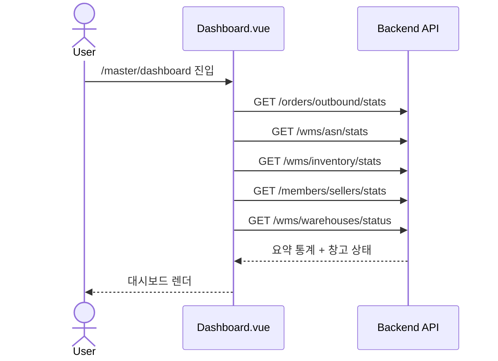

## Warehouse List

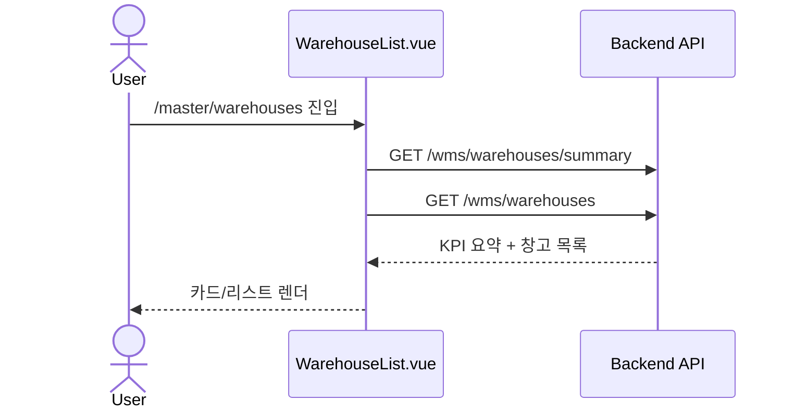

## Warehouse Register

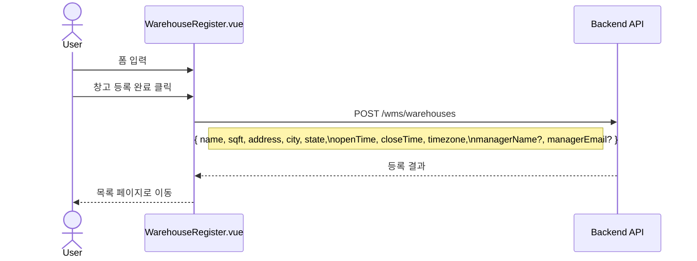

## Warehouse Detail

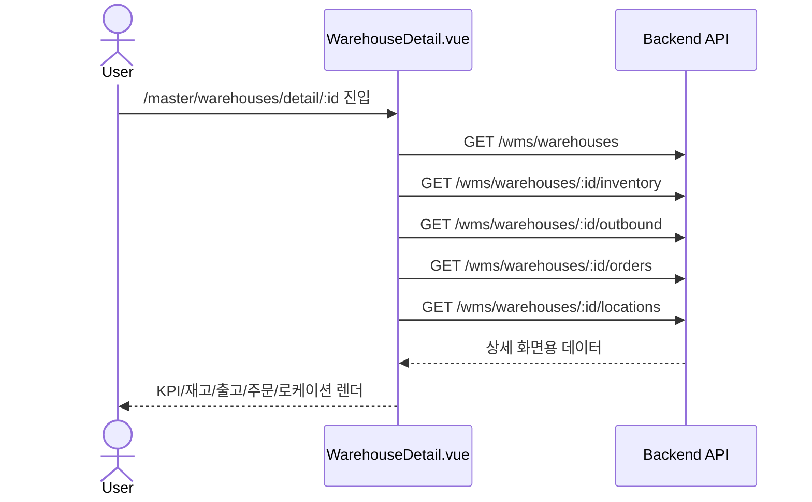

## ASN List

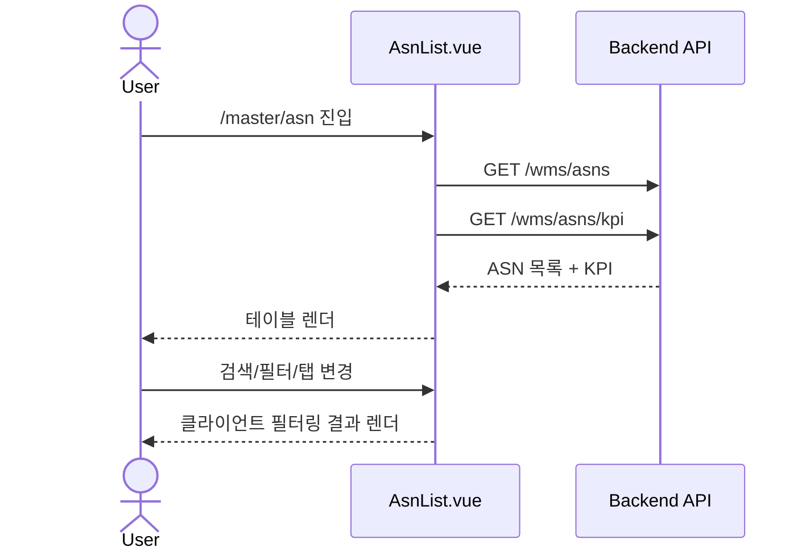

## Order List

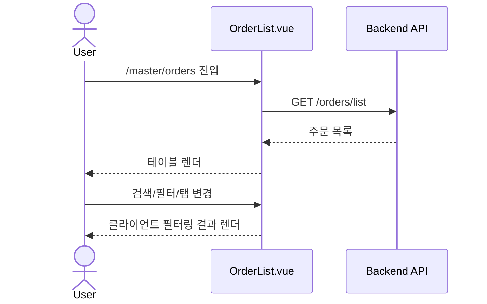

## Fee View

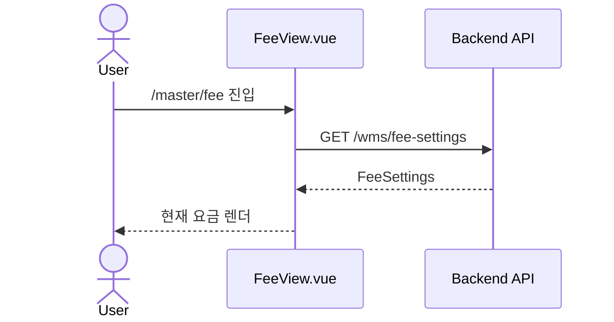

## Fee Settings

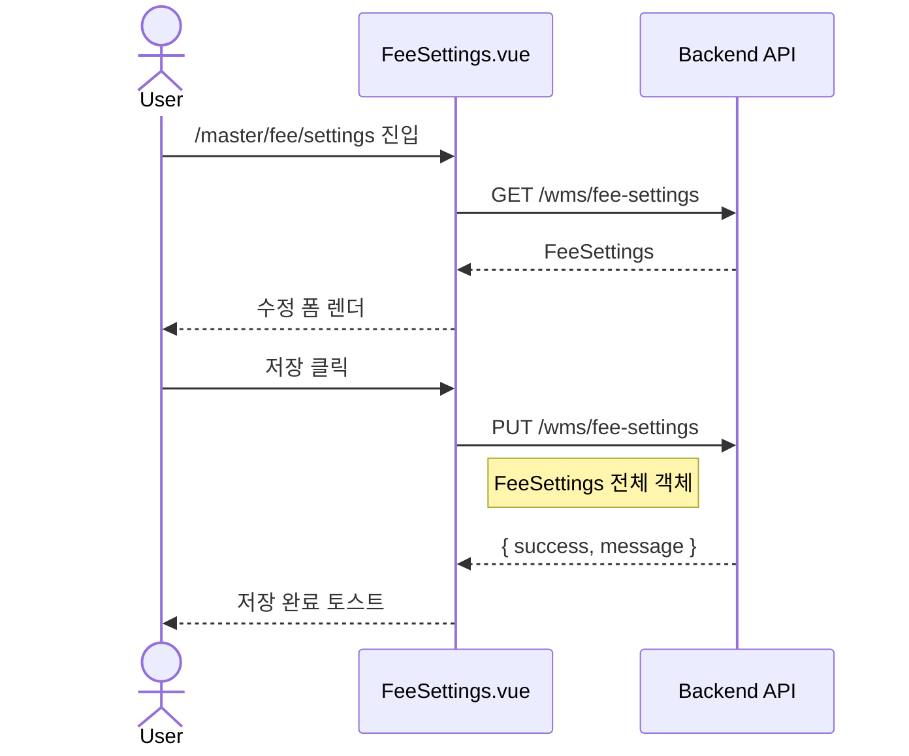

## Seller List

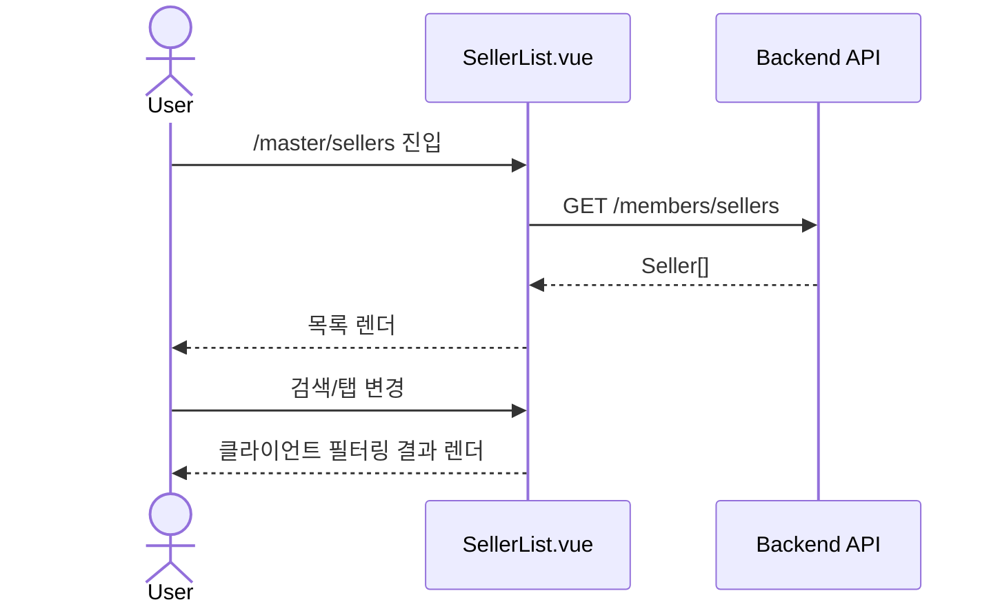

## Seller Register

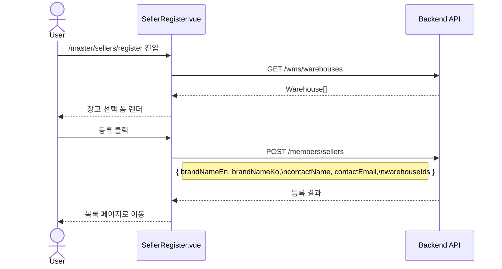

## Account Invite

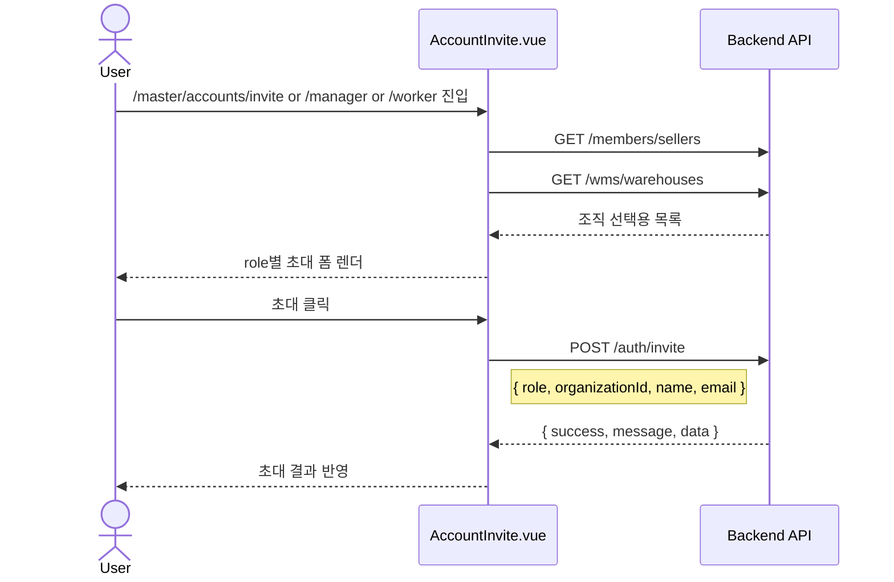

## User List

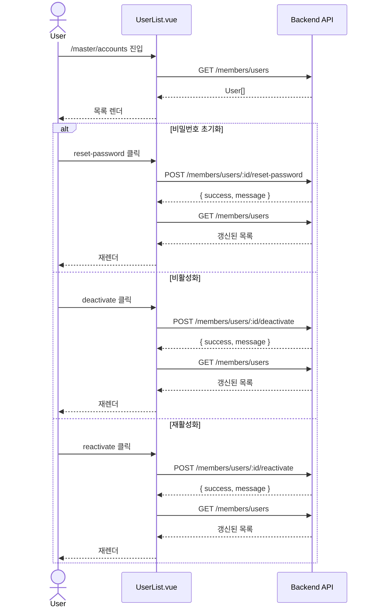

## RBAC Settings

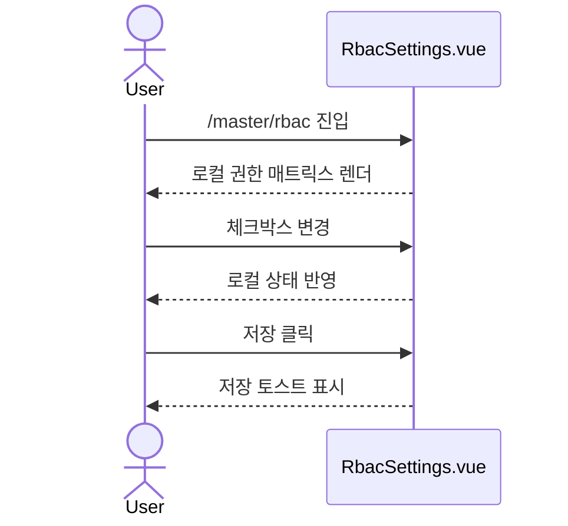
